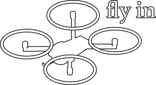
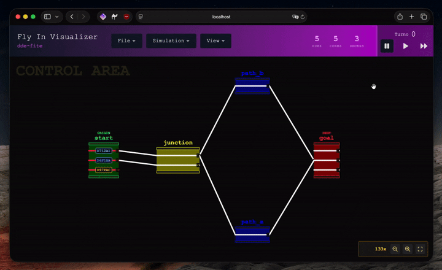
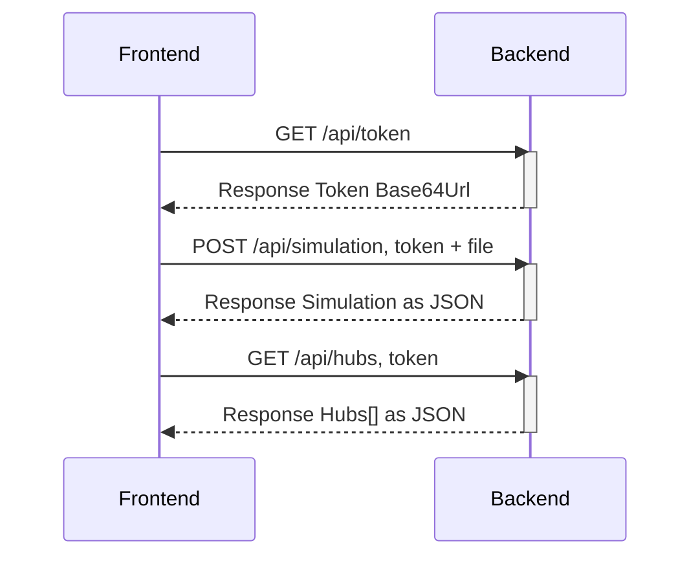
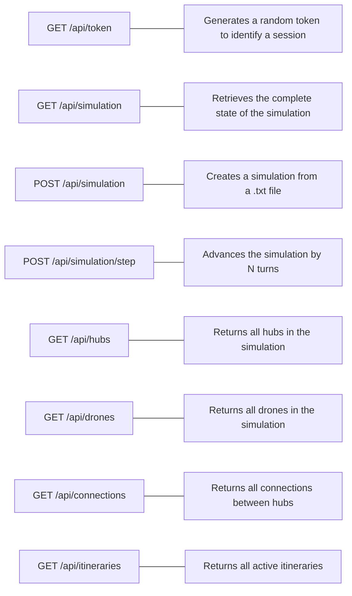
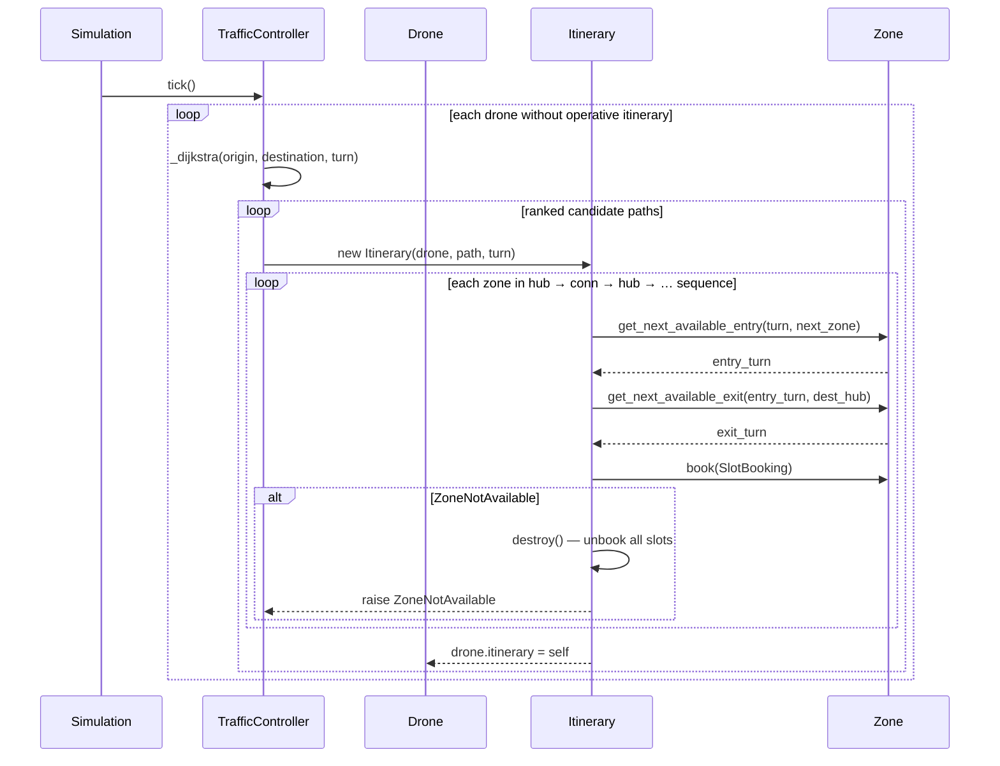

*This project has been created as part of the 42 curriculum by dde-fite*
<p align="center">
    
    <!-- <h1 align="center">42_Fly_in</h1>/ -->
</p>

<p align="center">
    
</p>

<p align="center">
This work is published under the terms of <a href="LICENSE"><b>MIT license</b></a>
</p>

<div align="center">
    <h2>Drone traffic simulation inspired by how railway networks move.</h2>
    
</div>

## Description

### Preamble

Imagine you’re in a city you don’t know and want to go to a store. You’ll probably pull out your phone and open your trusted maps app to get directions on the fastest way to get there. But have you ever stopped to think about the complexity behind it all?

There are many ways to find the shortest path between two points. For a long time, the only way was to try each route one by one until you found the best one. But of course, imagine being in a big city and having to walk down every street to find the shortest route to a coffee shop. That would be an excruciatingly long and inefficient process, wouldn’t it?

That’s how things were until the debate over pathfinding came to the forefront.

Alongside the boom in transportation - with improvements in speed and range—and the enormous increase in the number of travelers, a new need emerged: the need to keep everything under control. Every mistake or element left to chance became an accident leading to fatal consequences. That’s why traffic controls, protocols, and so on were introduced.

Railway networks pioneered the answer long before the digital age: **Centralized Traffic Control (CTC)**. A CTC system gives a single dispatcher full authority over every train in a network. No train moves without a granted path. Every track section and station platform has a finite capacity. Paths are reserved in advance across time, preventing two trains from ever competing over the same block of track. This reservation model — plan the route, lock the resources, move the vehicle — is the operational backbone of modern rail networks in Spain (governed by the *Reglamento de Circulación Ferroviaria*, RD 664/2015) and worldwide.

**Fly_in applies this exact model to autonomous drones.** Hubs are stations. Connections are track sections. The traffic controller is the CTC dispatcher. Drones hold their position until the controller grants a complete, conflict-free itinerary with every intermediate zone reserved for the exact turns the drone will occupy them — just as a train waits at a signal until the dispatcher clears the entire path ahead.

Fly_in is a 42 project aimed at creating an implementation that addresses these two needs. The challenge is to develop an autonomous drone navigation program that runs a simulation based on a map submitted by the user. This map, in a specific format, contains hubs (stations), connections between hubs, and the number of drones. The drones must find the shortest route to reach their destination, and the hubs and stations will have capacity limits that cannot be exceeded.

You are free to choose how to approach the project, as long as you do not use pathfinding libraries or graph data structures.

The program will run in turns, and for each turn, the drones’ movements will be printed following this example:

```
D1-roof1 D2-corridorA
D1-roof2 D2-tunnelB
D1-goal D2-goal
```

### Architecture
This project consists of a web service that allows users to upload maps, view the simulation, and control it. Its structure consists of a monorepo with a backend built using FastAPI and a frontend built using React and served by a static server written in Python.

Both parties must be running simultaneously and communicate via REST requests.


### Backend
It is the simulation controller. It is responsible for parsing maps, generating trajectories, and managing resources.

It is built with FastAPI and stores data in a cache using Cachetools. It exposes a REST API to interact with the simulation, as well as to create one from a map.

For all requests related to a simulation, you must provide a token that serves as a session identifier. This token must be in Base64Url format and must contain 32 bytes. When you create a simulation, it is associated with the token.


#### Parser
It has two available modes: **normal mode** and **strict mode**. Normal mode allows you to declare connections between hubs before declaring the hubs themselves, and allows the number of drones to be declared anywhere on the map. Strict mode prohibits this to comply with the new restrictions in the Fly_in rules as of the latest update at the time of writing.

It works by reading the file line by line and adding the information it processes to a dictionary.

The line-by-line processing flow is as follows:

1. Discard everything after the ‘#’ character, which is used for comments.

2. Read the first word and pass it through a switch statement; depending on whether it is ‘nb_drones’, ‘hub’ (or ‘start_hub’ and ‘end_hub’), or ‘connection’, it will undergo a different process.
    1. If it is ‘nb_drones’: Check if the data has already been defined and pass it to the `parse_nb_drones` function, which will convert it to an integer. In strict mode, it checks if it is the first line, excluding comments.
    2. If it is ‘hub’: It calls the `parse_hub` function. This function parses each piece of data and adds it to a dictionary, which it later returns.
	3. If it is ‘connection’: It calls the `parse_connection` function. This function parses each piece of data and adds it to a dictionary, which it later returns. In strict mode, it checks that the hubs it connects to have been previously declared.
3. It returns a dictionary containing the hubs, connections, and the number of drones.

#### Domain
Data classes are divided into two parts: **models** and **schemas**.

The models contain all the simulation data; some are standard Python classes, while others are Pydantic models, as they are designed to be passed directly from the parser to the model. 

**List of models:**

Standard classes:
- Itinerary
- Simulation
- Traffic controller

Dataclass:
- Turn
- Slot booking
- Vector

Annotated:
- Simulation token

Pydantic Models:
- Connection
- Hub
- Transitable zone
- Drone

Schemas are Pydantic models that define how the API responds. Whenever the backend responds to a REST request with simulation-related data, it will return a schema created from the data in a model. The conversion from model data to schema is performed using a mapper.

#### Traffic

**The traffic system is a direct software implementation of the CTC model used in railway operations.** The mapping is 1-to-1:

| Railway CTC | Fly_in |
|---|---|
| Station / platform bay | Hub (with capacity limit) |
| Track section / block | Connection (with capacity limit) |
| CTC dispatcher | Traffic Controller |
| Train path / running line | Itinerary |
| Block section reservation | Slot Booking |
| Signal aspect / route authority | Zone access type (`normal`, `priority`, `blocked`) |

For a drone to move, the traffic controller must grant it an itinerary — a complete, conflict-free sequence of hubs and connections with reserved time windows for every zone along the route. Until an itinerary is granted the drone holds its position, exactly as a train waits at a stop signal until the dispatcher clears the entire path ahead. When building an itinerary, the system requests permission from each hub and connection to authorize the drone’s entry and exit, creating a Slot Booking that records the reserved window. If any zone cannot be booked, the entire itinerary is rolled back atomically — no partial reservations persist, guaranteeing network-wide consistency.

##### Traffic Controller

The controller runs `tick()` once per simulation turn. For every drone that lacks an operative itinerary, it calls `request_itinerary`, which:

1. Skips drones mid-connection (route planning is only valid from a hub).
2. Runs a **time-aware Dijkstra** to find all viable routes sorted by arrival turn.
3. Attempts to book the best route as an `Itinerary`. If booking fails (another drone grabbed a slot between planning and committing), it falls back to the next candidate in ranked order.



##### Itinerary

An itinerary takes the ordered list of hubs found by Dijkstra and expands it into an interleaved sequence of zones:

Each zone in the sequence is booked atomically: if any zone cannot be booked, the whole itinerary is rolled back (all previous slot bookings are released) and a `ZoneNotAvailable` exception is propagated to the controller so it can try the next candidate path.

Every turn, `Itinerary.tick()` validates the itinerary: it destroys itself if all bookings have been consumed (the drone has arrived), and raises `ExpiredItinerary` if the drone has overstayed its exit slot or if a booking was removed from its host zone by an external event.

##### Slot Booking

A `SlotBooking` is a frozen record that represents the permission for a drone to occupy a zone during a specific time window. It contains:

| Field | Description |
|---|---|
| `host` | The zone (hub or connection) that granted the slot |
| `guest` | The drone that holds the reservation |
| `enter_turn` | The turn on which the drone enters the zone |
| `exit_turn` | The turn on which the drone must leave (`None` for the final destination) |

Zones use their collection of `SlotBooking` entries to determine available capacity when answering `get_next_available_entry` / `get_next_available_exit` queries from the planner.

## Instructions

### Prerequisites

- Python 3.10+
- Node.js (for the frontend dev tools and build)
- A Python virtual environment activated before running any `make` target — both `backend/` and `frontend/` Makefiles warn and abort if no virtualenv is detected.

### Installation

From the repo root:

```bash
make install      # pip-installs backend + frontend Python deps
make install-dev  # installs backend dev deps + frontend npm packages
```

### Environment variables

#### Frontend

| Variable | Required | Default | Description |
|---|---|---|---|
| `VITE_BACKEND_URL` | **yes** | — | Base URL of the backend API. The app throws at startup if missing. |
| `PORT` | no | `3000` | Port for the Vite dev server. |

Set them in a `.env` file at `frontend/` or export them in the shell before running:

```bash
export VITE_BACKEND_URL=http://localhost:3000
```

`VITE_BACKEND_URL` must be set **before** `make build` or `make dev` — Vite inlines it at build time, so changing it after building requires a rebuild.

#### Backend

Backend variables are read via `pydantic-settings` (`BaseSettings`), so they can be set as shell exports or in a `.env` file at `backend/`.

| Variable | Default | Description |
|---|---|---|
| `FRONTEND_URL` | `http://localhost:3000` | Allowed CORS origin. Must match the URL where the frontend is served. |
| `LOG_LEVEL` | `DEBUG` | Python logging level (`DEBUG`, `INFO`, `WARNING`, `ERROR`). |
| `EXTENDED_LOGGING` | `false` | If `true`, logs detailed per-zone booking events and Dijkstra decisions. Verbose — only useful for debugging the traffic system. |
| `STRICT_PARSER` | `true` | If `true`, enforces strict map format (connections must reference already-declared hubs; `nb_drones` must be the first non-comment line). |

### Running (recommended)

The root Makefile launches both services concurrently with a single command:

```bash
make run   # production mode: FastAPI + static server (granian, port 3000)
make dev   # dev mode: FastAPI with hot-reload + Vite dev server
```

### Running individually

Each service can be started from its own directory:

```bash
# Backend (from backend/)
make run   # fastapi run src  (production)
make dev   # fastapi dev src  (hot-reload)

# Frontend (from frontend/)
make run   # build if needed, then serve via granian on port 3000
make dev   # Vite dev server
```

### Other targets

| Target | Scope | Description |
|---|---|---|
| `make lint` | root / each | flake8 + mypy (backend), Biome + flake8 + mypy (frontend) |
| `make test` | `backend/` | pytest |
| `make debug` | root / `backend/` | pdb on the backend entry point |
| `make clean` | root / each | remove caches (`__pycache__`, `.mypy_cache`, etc.) |
| `make fclean` | root / each | clean + remove build artifacts and `node_modules` |

## Algorithm

The pathfinding algorithm is a **time-aware Dijkstra** where edge weights are not static hop counts but the real temporal cost at planning time. Each zone is queried for its next available entry/exit slot considering existing bookings and capacity limits, so congested zones are naturally penalised by the extra wait time they impose. Blocked hubs are pruned at expansion time, cycles are avoided via a per-path `frozenset` membership check, and a `_MAX_WAIT` cap prevents live-lock on saturated graphs.

Neighbour expansion is done in alphabetical name order to make route planning deterministic across runs.

## Visual representation

The visualizer is a web application built with **React + Konva** that renders the simulation on a 2D canvas using a **railway metaphor**: hubs are stations with platforms and tracks, connections are bundles of rails (one rail per capacity unit), and drones are labelled blocks that park at a station or slide along a rail between turns.

### Canvas

The canvas is drawn on a Konva `<Stage>` with a single `<Layer>`. All drawing logic lives in pure functions (`canvas/`) that receive a `View` (scale + pan) and a `Scene` (the current state snapshot) and write to a `CanvasRenderingContext2D`. Konva only owns the scene graph and event capture; the draw functions are framework-agnostic and fully unit-testable.

Pan and zoom are managed via a custom `View` transform (`modelToCanvas`) applied at draw time and at hit-test time — **not** through Konva's built-in stage transform. This keeps drawing and click detection in a single source of truth.

**Color coding by hub access type:**

| Access | Rail color |
|---|---|
| `normal` | White |
| `priority` | Green |
| `blocked` | Red |
| `rainbow` | Cycles through the spectrum each frame |

### Interaction

Clicking a hub or a connection opens a floating **detail panel** in the top-right corner:

- **Hub panel** — position, access type, capacity, current drone count, connected hubs, color.
- **Connection panel** — endpoint hubs, capacity, active drones.

Click detection uses a manual hit-test (`hitTest.ts`) against the same geometry used for drawing — hubs take priority over connections, and connection tolerance scales with zoom.

### Playback

| Control | Action |
|---|---|
| `→` | Advance one turn |
| `Shift+→` | Advance 10 turns |
| `Space` | Toggle play / pause |
| Play mode | Auto-advance every second |
| Fast mode | Auto-advance every ~333 ms |
| `f` | Fit all hubs into view |

### Drone animation

When a turn advances, drones that changed hub slide along their assigned rail from the origin station to the destination station. The slide duration is divided by the current playback speed so it always finishes before the next turn arrives. In pause mode the animation runs at full duration. Drones that did not move stay parked on their station track.

## Resources

### Pathfinding
- [Wikipedia: Dijkstra's algorithm](https://en.wikipedia.org/wiki/Dijkstra%27s_algorithm)
- [DataCamp: Dijkstra's algorithm in Python](https://www.datacamp.com/tutorial/dijkstra-algorithm-in-python)
- [GeeksforGeeks: Python program for Dijkstra's shortest path algorithm — Greedy Algo-7](https://www.geeksforgeeks.org/python/python-program-for-dijkstras-shortest-path-algorithm-greedy-algo-7/)
- [W3Schools: Dijkstra's algorithm](https://www.w3schools.com/dsa/dsa_algo_graphs_dijkstra.php)
- [Medium: Shortest path: Dijkstra's algorithm step-by-step Python guide](https://medium.com/data-science/shortest-path-dijkstras-algorithm-step-by-step-python-guide-896769522752)
- [YouTube: Dijkstra's Algorithm Visualized and Explained - Carl the Person](https://www.youtube.com/watch?v=71Z-Jpnm3D4)
- [YouTube: Dijkstra's algorithm in 3 minutes - Michael Sambol](https://www.youtube.com/watch?v=_lHSawdgXpI)
- [YouTube: Dijkstra’s Algorithm | Graphs | Min Heap | Priority Queue | Shortest Path | Animation -
Depth First](https://www.youtube.com/watch?v=NyrHRNiRpds)
- [YouTube: The Science Behind Google Maps | Route Finding Algorithms - Shrouded Science](https://www.youtube.com/watch?v=QhcerJZD1Gc&t=2s)
- [YouTube: Pathfinding for Indie Games: A* vs Dijkstra in NYC (Visualized) - Not Full Stack](https://www.youtube.com/watch?v=zZp2Zv5oOTU)
- [YouTube: How does Google Maps find the shortest path? - The Unqualified Tutor](https://www.youtube.com/watch?v=WJFWb9Z5uHY)

### Traffic model based in railway
- [SimSig](https://www.simsig.co.uk/)
- [BOE: Real Decreto 664/2015, de 17 de julio, por el que se aprueba el Reglamento de Circulación Ferroviaria.](https://www.boe.es/buscar/act.php?id=BOE-A-2015-8042)
- [Wikipedia: Centralized traffic control](https://en.wikipedia.org/wiki/Centralized_traffic_control)

### Backend
- [Python documentation](https://docs.python.org/3/library/)
- [FastAPI documentation](https://fastapi.tiangolo.com/)
- [Pydantic documentation](https://pydantic.dev/docs/)
- [Cachetools documentation](https://cachetools.readthedocs.io/en/stable/)
- [Pytest documentation](https://docs.pytest.org/en/stable/)
- [Real Python: Get Started with FastAPI](https://realpython.com/get-started-with-fastapi/)
- [GeeksforGeeks: REST API with FastAPI](https://www.geeksforgeeks.org/python/rest-api-with-fastapi/)
- [GeeksforGeeks: Middlewares in FastAPI](https://www.geeksforgeeks.org/python/middlewares-in-fastapi/)
- [GeeksforGeeks: Cachetools module in Python](https://www.geeksforgeeks.org/python/cachetools-module-in-python/)

### Frontend
- [Konva.js documentation](https://konvajs.org/docs/)
- [React documentation](https://react.dev/)
- [Tailwind CSS documentation](https://tailwindcss.com/docs)
- [Zustand documentation](https://zustand.docs.pmnd.rs/learn/)
- [Zod documentation](https://zod.dev/)
- [Vite documentation](https://v3.vitejs.dev/guide/)
- [Biome documentation](https://biomejs.dev/guides/getting-started/)
- [Vitest documentation](https://vitest.dev/guide/)
- [React Konva's README](https://github.com/konvajs/react-konva)

### AI usage

Claude was used for the following tasks:

- Code review: identifying logic errors, type-safety issues, and deviations from project conventions in backend and frontend code.
- Documenting functions: writing docstrings for backend models, services, and traffic system classes; writing this README.
- Refactoring: restructuring modules for single-responsibility, improving naming, and removing duplication.

GitHub Copilot was used for the following tasks:

Code completion and suggestions, particularly in areas where repetitive patterns were present, such as API endpoint definitions and data model creation.

### Other resources

- [GNU Make Manual: Parallel Execution](https://www.gnu.org/software/make/manual/html_node/Parallel.html)